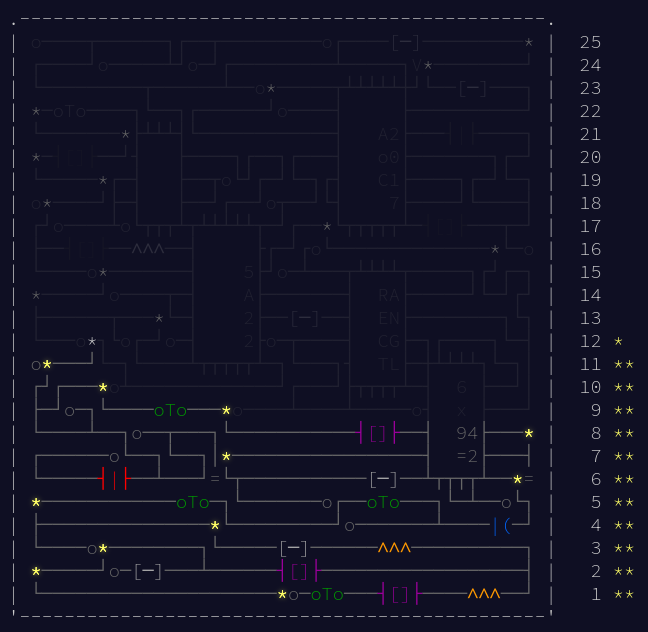

= Advent of code, 2017
:doctype: book
:toc:

image:https://godoc.org/gitlab.com/jhinrichsen/adventofcode2017?status.svg["godoc", link="https://godoc.org/gitlab.com/jhinrichsen/adventofcode2017"]
image:https://goreportcard.com/badge/gitlab.com/jhinrichsen/adventofcode2017["Go report card", link="https://goreportcard.com/report/gitlab.com/jhinrichsen/adventofcode2017"]
image:https://gitlab.com/jhinrichsen/adventofcode2017/badges/master/pipeline.svg[link="https://gitlab.com/jhinrichsen/adventofcode2017/-/commits/master",title="pipeline status"]
image:https://gitlab.com/jhinrichsen/adventofcode2017/badges/master/coverage.svg[link="https://gitlab.com/jhinrichsen/adventofcode2017/-/commits/master",title="coverage report"]

== Introduction

I don't aim for speed of implementation, meaning being the first to submit.
While Advent of Code emphasizes speed, I prioritize completeness and getting the first answer correct on the first try.
The number of tries is priority number one, so you will find exhaustive test cases.
Although puzzle solutions are user specific, the test cases (`dayNN_test.go`) contain the hardcoded results, so you can safely look at the solutions (`dayNN.go`).

After correctness, I use the problems for performance tuning: minimize runtime and minimize memory allocations.

My usual setup for Advent of Code according to https://treeform.github.io/devcompas/[Dev Compass].

== Benchmarks

----
goos: linux
goarch: amd64
pkg: gitlab.com/jhinrichsen/adventofcode2017
cpu: Intel(R) Core(TM) i7-14700K
BenchmarkDay01Part2
BenchmarkDay01Part2-28    	  210760	      5516 ns/op	    2048 B/op	       1 allocs/op
BenchmarkDay01Part1
BenchmarkDay01Part1-28    	  199624	      5291 ns/op	    2048 B/op	       1 allocs/op
BenchmarkDay02Part1
BenchmarkDay02Part1-28    	14416908	        82.54 ns/op	       0 B/op	       0 allocs/op
BenchmarkDay02Part2
BenchmarkDay02Part2-28    	  351073	      3413 ns/op	       0 B/op	       0 allocs/op
BenchmarkDay03Part1
BenchmarkDay03Part1-28    	      67	  17072238 ns/op	       0 B/op	       0 allocs/op
BenchmarkDay03Part2
BenchmarkDay03Part2-28    	64485747	        18.58 ns/op	       0 B/op	       0 allocs/op
BenchmarkDay04Part1
BenchmarkDay04Part1-28    	    8886	    257762 ns/op	  137056 B/op	    1016 allocs/op
BenchmarkDay04Part2
BenchmarkDay04Part2-28    	     703	   1729363 ns/op	  936510 B/op	   18964 allocs/op
BenchmarkDay05Part1
BenchmarkDay05Part1-28    	    3030	    393158 ns/op	    9472 B/op	       1 allocs/op
BenchmarkDay05Part2
BenchmarkDay05Part2-28    	      24	  47536789 ns/op	    9472 B/op	       1 allocs/op
BenchmarkDay06Part1
BenchmarkDay06Part1-28    	 8534137	       140.4 ns/op	       0 B/op	       0 allocs/op
BenchmarkDay06Part2
BenchmarkDay06Part2-28    	     285	   4705583 ns/op	 3544878 B/op	      75 allocs/op
BenchmarkDay07Part1
BenchmarkDay07Part1-28    	    2322	    437938 ns/op	  237720 B/op	    1472 allocs/op
BenchmarkDay07Part2
BenchmarkDay07Part2-28    	     896	   1234042 ns/op	  665520 B/op	    2505 allocs/op
BenchmarkDay08Part1
BenchmarkDay08Part1-28    	    4647	    536285 ns/op	  292168 B/op	    2018 allocs/op
BenchmarkDay08Part2
BenchmarkDay08Part2-28    	    2372	    588171 ns/op	  292168 B/op	    2018 allocs/op
BenchmarkDay09Part1
BenchmarkDay09Part1-28    	   25558	     46511 ns/op	       0 B/op	       0 allocs/op
BenchmarkDay09Part2
BenchmarkDay09Part2-28    	   35662	     33686 ns/op	       0 B/op	       0 allocs/op
BenchmarkDay10Part1
BenchmarkDay10Part1-28    	  276610	      3895 ns/op	    2048 B/op	       1 allocs/op
BenchmarkDay10Part2
BenchmarkDay10Part2-28    	   16506	     72651 ns/op	     576 B/op	      19 allocs/op
BenchmarkDay11Part1
BenchmarkDay11Part1-28    	   74281	     15418 ns/op	       0 B/op	       0 allocs/op
BenchmarkDay11Part2
BenchmarkDay11Part2-28    	   63178	     18906 ns/op	       0 B/op	       0 allocs/op
BenchmarkDay12Part1
BenchmarkDay12Part1-28    	    2065	    979302 ns/op	  555865 B/op	    9707 allocs/op
BenchmarkDay12Part2
BenchmarkDay12Part2-28    	     897	   1444676 ns/op	  694666 B/op	    9725 allocs/op
----

== Overview

Number of tries for a correct answer:

|===
| Day | Part 1 | Part 2
| 1   |   1    |   1
| 2   |   1    |   1
| 3   |   1    |   3
| 4   |   1    |   1
| 5   |   1    |   1
| 6   |   1    |   1
| 7   |   1    |   1
| 8   |   1    |   1
| 9   |   1    |   1
| 10  |   2    |   1
| 11  |   1    |   1
| 12  |   1    |
| 13  |   1    |   1
| 14  |   1    |   1
| 15  |   1    |   1
| 16  |        |
| 17  |        |
| 18  |        |
| 19  |        |
| 20  |   1    |   1
| 21  |        |
| 22  |   1    |   1
| 23  |   1    |   1
| 24  |        |
| 25  |        |
|===

== Day 1: Inverse Captcha

== Day 2: Corruption Checksum

== Day 3: Spiral Memory

=== Part 2

https://oeis.org/A141481

----
{
	m=5;
	h=2*m-1;
	A=matrix(h, h);
	print1(A[m, m]=1, ", ");
	T=[[1, 0], [1, -1], [0, -1], [ -1, -1], [ -1, 0], [ -1, 1], [0, 1], [1, 1]];

	for (n=1, (h-2)^2-1,
		g=sqrtint(n);
		r=(g+g%2)\2;
		q=4*r^2;
		d=n-q;
		if (n<=q-2*r,
			j=d+3*r;
			k=r, if(n<=q, j=r; k=-d-r, if(n<=q+2*r, j=r-d; k=-r, j=-r; k=d-3*r)));
		j=j+m;
		k=k+m;
		s=0;
		for (c=1, 8, v=[j, k];
			v+=T[c];
			s=s+A[v[1], v[2]]);

		A[j, k]=s;
		print1(s, ", "))
}
----

I know a thing or two about C but this is just too dense to translate to Go.
The PARI based implementation uses no blocks, but comma operators all over the place and for loops in the arguments of a for loop.
I'll take the easy route and use the [https://oeis.org/A141481/b141481.txt] result table.

== Day 4: High-Entropy Passphrases

== Day 5: A Maze of Twisty Trampolines, All Alike

== Day 6: Memory Reallocation

== Day 7: Recursive Circus

== Day 8: I Heard You Like Registers

== Day 9: Stream Processing

== Day 10: Knot Hash

First try 52530 is too high.
Classical off-by-one in index (0..255 <-> 1..256).

== Day 11: Hex Ed

== Day 12: Digital Plumber

== Day 13: Packet Scanners

== Day 14: Disk Defragmentation

=== Performance Optimizations

Day 14 requires computing 128 knot hashes (Day 10 Part 2), making it computationally intensive.
Three optimization iterations were benchmarked:

**b0 (baseline)**: Initial implementation
- Switch statement for hex conversion
- Inner loop for bit extraction
- `fmt.Sprintf` for string formatting
- Recursive flood fill

**b1**: Parsing optimizations
- Hex lookup table `[256]byte` instead of switch
- Unrolled 4-bit extraction (no inner loop)
- `strconv.Itoa` instead of `fmt.Sprintf`
- Iterative flood fill with explicit stack

**b2**: Inlined knot hash
- Inlined Day10Part2 into NewDay14
- Reused buffers across 128 iterations (lengths, list, dense)
- Direct byte→bit conversion (no hex string intermediate)
- Eliminated 128 function calls and string allocations

==== Benchmark Results

b0 → b1:
----
              │  b0.clean   │              b1.clean              │
              │   sec/op    │   sec/op     vs base               │
Day14Part1-16   4.803m ± 1%   4.816m ± 1%       ~ (p=0.631 n=10)
Day14Part2-16   5.018m ± 1%   4.991m ± 1%  -0.55% (p=0.009 n=10)

              │   b0.clean   │              b1.clean               │
              │     B/op     │     B/op      vs base               │
Day14Part1-16   48.65Ki ± 0%   44.76Ki ± 0%  -8.00% (p=0.000 n=10)
Day14Part2-16   48.65Ki ± 0%   44.75Ki ± 0%  -8.01% (p=0.000 n=10)

              │  b0.clean   │              b1.clean              │
              │  allocs/op  │  allocs/op   vs base               │
Day14Part1-16   2.568k ± 0%   2.340k ± 0%  -8.88% (p=0.000 n=10)
Day14Part2-16   2.568k ± 0%   2.340k ± 0%  -8.88% (p=0.000 n=10)
----

b1 → b2:
----
              │  b1.clean   │              b2.clean              │
              │   sec/op    │   sec/op     vs base               │
Day14Part1-16   4.816m ± 1%   4.971m ± 1%  +3.22% (p=0.000 n=10)
Day14Part2-16   4.991m ± 1%   5.113m ± 1%  +2.46% (p=0.000 n=10)

              │   b1.clean   │               b2.clean               │
              │     B/op     │     B/op      vs base                │
Day14Part1-16   44.76Ki ± 0%   20.29Ki ± 0%  -54.67% (p=0.000 n=10)
Day14Part2-16   44.75Ki ± 0%   20.29Ki ± 0%  -54.67% (p=0.000 n=10)

              │   b1.clean   │              b2.clean              │
              │  allocs/op   │ allocs/op   vs base                │
Day14Part1-16   2340.00 ± 0%   36.00 ± 0%  -98.46% (p=0.000 n=10)
Day14Part2-16   2340.00 ± 0%   36.00 ± 0%  -98.46% (p=0.000 n=10)
----

b0 → b2 (final):
----
              │  b0.clean   │              b2.clean              │
              │   sec/op    │   sec/op     vs base               │
Day14Part1-16   4.803m ± 1%   4.971m ± 1%  +3.49% (p=0.000 n=10)
Day14Part2-16   5.018m ± 1%   5.113m ± 1%  +1.90% (p=0.000 n=10)

              │   b0.clean   │               b2.clean               │
              │     B/op     │     B/op      vs base                │
Day14Part1-16   48.65Ki ± 0%   20.29Ki ± 0%  -58.30% (p=0.000 n=10)
Day14Part2-16   48.65Ki ± 0%   20.29Ki ± 0%  -58.30% (p=0.000 n=10)

              │   b0.clean   │              b2.clean              │
              │  allocs/op   │ allocs/op   vs base                │
Day14Part1-16   2568.00 ± 0%   36.00 ± 0%  -98.60% (p=0.000 n=10)
Day14Part2-16   2568.00 ± 0%   36.00 ± 0%  -98.60% (p=0.000 n=10)
----

Overall: **-58% memory**, **-99% allocations** at the cost of +3% runtime.
The slight slowdown is likely due to larger function body reducing instruction cache efficiency, but the massive reduction in allocations significantly reduces GC pressure.

== Day 15: Dueling Generators

=== Performance Optimizations

Day 15 implements linear congruential generators (LCG) requiring billions of modulo operations.
Two implementations were benchmarked to compare Go compiler optimizations versus hand-written assembly.

**b0 (baseline)**: Pure Go implementation
- Simple modulo arithmetic: `(a * factor) % 2147483647`
- Bitwise comparison: `a&0xFFFF == b&0xFFFF`
- 40 million iterations (Part 1), 5 million pairs (Part 2)

**b1**: Hand-written AMD64 assembly
- Direct use of MULQ and DIVQ instructions for modulo
- Explicit register allocation (R14=a, R15=b, R8=matches)
- Same algorithm as b0, translated to assembly

==== Benchmark Results

----
              │    b0     │     b1      │
              │  sec/op   │   sec/op    │
Day15Part1-16   109ms       139ms         +27% slower
Day15Part2-16   196ms       231ms         +18% slower

Both: 0 B/op, 0 allocs/op
----

**Surprising result**: The assembly version is significantly slower than Go.

The Go compiler's optimizer produces faster code because:
- Modern Go compiler uses sophisticated optimizations for modulo operations
- The DIV instruction on x86-64 is notoriously slow (not well-pipelined, high latency)
- Go may use strength reduction or other algebraic optimizations
- Assembly version suffers from instruction decode overhead

This demonstrates that hand-written assembly is not always faster on modern architectures with sophisticated compilers.
Both implementations achieve zero allocations.

== Day 16: Permutation Promenade

== Day 17: Spinlock

=== Performance Optimizations

Day 17 implements a circular buffer with 2017 insertions.
The maximum buffer size is known (2018 elements), enabling pre-allocation.

Two approaches were compared:

**Array-backed linked list**: O(1) insertion
- Pre-allocate array of 2018 nodes
- Each node stores value and next index
- Insert by updating pointers only
- Requires ~661,000 pointer chases (328 steps × 2017 insertions)

**Pre-allocated slice**: O(n) insertion with copy()
- Pre-allocate with capacity 2018: `make([]int, 1, 2018)`
- Insert using `append()` + `copy()` to shift elements
- Uses highly optimized `memmove` (vectorized CPU instructions)

==== Benchmark Results

----
                        │  Linked List  │  Slice + copy()  │
                        │    sec/op     │     sec/op       │
Day17Part1-16 (2017)      816μs           68μs              12x faster

Both: 0 B/op, 0 allocs/op
----

**Surprising result**: The O(n) slice approach is 12x faster than O(1) linked list.

Why slice + copy() wins:
- `copy()` uses optimized `memmove` with vectorized SIMD instructions
- Sequential memory access is cache-friendly (spatial locality)
- CPU prefetcher can predict and preload data
- Modern CPUs excel at bulk memory operations

Why linked list loses:
- Pointer chasing causes random memory access (cache misses)
- Each step requires dereferencing: `current = nodes[current].next`
- Poor spatial locality defeats CPU cache hierarchy
- No opportunity for SIMD vectorization

**Lesson**: Algorithmic complexity (Big-O) doesn't predict real-world performance.
Hardware characteristics (cache, SIMD, prefetching) often dominate constant factors.
The "theoretically slower" O(n) algorithm wins due to hardware realities.

== Day 18: Duet

== Day 19: A Series of Tubes

== Day 20: Particle Swarm

== Day 21: Fractal Art

== Day 22: Sporifica Virus

== Day 23: Coprocessor Conflagration

== Day 24: Electromagnetic Moat

== Day 25: The Halting Problem
